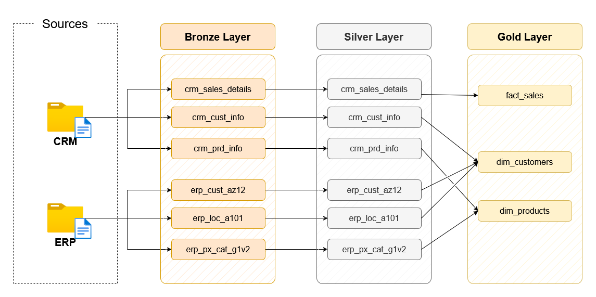
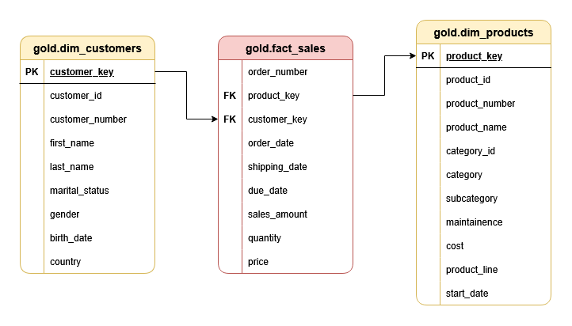

# Data Warehouse Project

This project demonstrates a data warehousing solution built using PostgreSQL and the Medallion Architecture. It follows a structured approach to data processing, ensuring data quality, consistency, and efficiency.

---
## 🏗️ Data Architecture

The data architecture for this project follows Medallion Architecture **Bronze**, **Silver**, and **Gold** layers:

1. **Bronze Layer**: Stores raw data as it is from the source systems. Data is ingested from CSV Files into SQL Server Database.
2. **Silver Layer**: This layer includes data cleansing, standardization, and normalization processes to prepare data for analysis.
3. **Gold Layer**: Houses business-ready data modeled into a star schema required for reporting and analytics.

---

## 📖 Project Overview

This project involves:

1. **Data Architecture**: Designing a Modern Data Warehouse Using Medallion Architecture **Bronze**, **Silver**, and **Gold** layers.
2. **ETL Pipelines**: Extracting, transforming, and loading data from source systems into the warehouse.
3. **Data Modeling**: Developing fact and dimension tables optimized for analytical queries.

### Data Flow 

The Data Flow diagram visually represents how data moves through different layers of the Medallion Architecture. It showcases the source systems (CRM & ERP) and their journey through the Bronze, Silver, and Gold layers, ensuring a structured and efficient data transformation process.

### Data Model

The Data Model diagram illustrates the relationships between fact and dimension tables in the Gold Layer. It follows a star schema, optimizing the data for reporting and analytics. The fact_sales table stores transactional data, while dim_customers and dim_products provide descriptive attributes for deeper insights.
